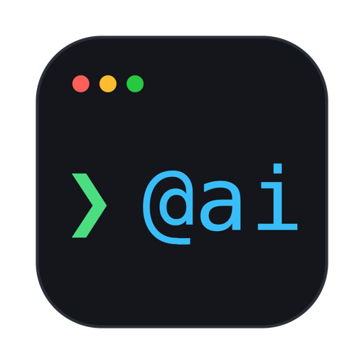

<div align="center">



# aiTerminal

### ⚡ Fast. 🪶 Light. ✨ AI-first.

A terminal written **from scratch in Rust** — **zero external crates**, no Electron, no web view.

[](LICENSE)
[](https://www.rust-lang.org/)
[](Cargo.toml)
[](https://github.com/mourad-ghafiri/aiTerminal/releases)

**[🌐 Website](https://mourad-ghafiri.github.io/aiTerminal/)** ·
**[📖 Docs](docs/README.md)** ·
**[⬇️ Download](https://github.com/mourad-ghafiri/aiTerminal/releases)**

</div>

---

<div align="center">

## 🎬 See it in action


**[▶️ Watch in full quality](video.mp4)** — 90 seconds. Your prompt is about to get *superpowers*. ✨

</div>

---

It is a *terminal*, full stop: PTY panes, tabs and splits, themes, keymaps, plugins,
profiles. The AI is woven into the shell itself through one idea:

> 💡 **Everything is a terminal command.** No settings UI, no side apps — you type
> `@`-commands at your normal prompt and edit TOML files.

```text
❯ @ai find the 5 biggest files under src and sort them
❯ press Enter to run (or edit)
❯ du -a src | sort -rn | head -5

❯ @coder "add a --json flag to the export command"        # a full agentic run
❯ @flow review "the auth module"                          # a multi-step workflow
❯ @loop "make the tests pass" --check "cargo test"        # iterate until verified
❯ @flow implement --bg "migrate configs to TOML"          # …in the background
❯ @job                                                    # monitor runs + logs
❯ @profile switch work                                    # live profile switch
```

## 🌟 Highlights

- 🦀 **A real terminal, built from nothing** — a from-scratch VT engine, PTY, GPU
  renderer, TOML/JSON parsers, regex engine, BM25 ranker, HTTP transport. The
  dependency list is empty, and CI keeps it that way.
- ✂️ **Native-feel editing** — `⌥/⌘ arrows` jump by word / to the line ends,
  `⇧`+arrows **select on the command line** (a light band, your syntax colors
  stay on top), typing replaces the selection, `Esc` cancels, `⌘C` copies.
  All of it is a zsh plugin (`lineedit`), not hardcoded terminal magic.
- 🧘 **Calm, stable rendering** — steady block cursor (`bar`/`underline` one config
  line away), ghost-free damage-tracked frames, burst-settled presents, an idle
  event loop that uses near-zero CPU.
- 🔋 **31 builtin plugins, all data** — prompt, autosuggest, syntax highlighting,
  completion, history, git (100+ aliases), docker, kubernetes, extract, jump,
  sudo, clipboard (OSC 52), … Each is a `plugin.toml` + optional shell snippet;
  disable any with `@plugin disable <name>`.
- 🎨 **19 live themes** — `@theme <name>` restyles the window, the prompt, syntax
  colors and `ls` colors from any shell, instantly.
- 👤 **Profiles that mean it** — per-profile config overlay + saved workspace
  (tabs, splits, per-pane cwd/zoom, styled scrollback). `@profile switch work`
  from any shell; the window follows live.
- 🛡️ **AI with guardrails** — provider-agnostic streaming engine, weighted
  multi-model pools, agents/skills/prompts as Markdown, flows as TOML, BM25
  memory, MCP, sub-agents — behind a command guard (allow/deny/confirm) and
  secret redaction on every egress path. AI is **off** until you declare a model.

## ✨ The command family

| Command | What it does |
| --- | --- |
| 🪄 `@ai <request>` | Natural language → one shell command, checked by the command guard, preloaded for review (or auto-run per `[ai] mode`). |
| 🤖 `@<agent> <task>` | Run a named agent's full tool loop (read/search/edit/run, memory, MCP) and print its report. Ships with `coder`, `explorer`, `reviewer`, `tester`. |
| 🔀 `@flow [<name>] <text>` | Run a workflow. An unknown first word just becomes input to the default explore→implement→verify pipeline; bare `@flow` lists them. |
| 🔁 `@loop "<goal>" [--check "<cmd>"]` | An engineered agent loop: iterate until a **verifiable goal** passes (a check command, or an independent reviewer agent), with feedback between iterations and hard stop rules (max, no-progress, budget). |
| 📊 `@job [<task>]` | Run a **tracked** task: `@job build the docs --agent tester --bg` (agent + background optional). Bare `@job` lists runs + logs; `--bg` works on any agent/flow/loop too. |
| 👤 `@profile [<id>]` | List profiles, switch directly (`@profile work`), `create`/`rename`/`delete`, and `edit` (opens the overlay in `$EDITOR`). A running window follows switches and edits live. |
| ⚙️ `@config` / `@theme` / `@plugin` | Inspect config, list/**switch** themes live (`@theme nord`), manage plugins. |

`@`-commands ride the shell's `command_not_found` hook, so they can never shadow a
real command, and everything streams straight into your terminal scrollback.

## 🔋 Batteries included — 31 plugins, pure data

A plugin is a `plugin.toml` — nothing compiles, nothing slows your prompt.

| | Category | Plugins |
| --- | --- | --- |
| 💻 | **Shell UX** | 🎨 syntax-highlight · 👻 autosuggest · 🧠 history · ⌨️ completion · ✂️ lineedit · 💡 alias-hints · 🚀 prompt · 🔼 sudo · 📁 dir · 🧭 jump · 🌍 term-cwd |
| 🛠️ | **Git & dev** | ⎇ git · 🐙 github · 🐳 docker · ☸️ kubernetes · 🦀 rust · 🐍 python · 📦 node |
| 🧰 | **Utilities** | 🗜 extract · 📋 clipboard · 🔐 encode · 🔎 web-search · 🌦 weather · 🕰 world-clock · 📝 notes · 📟 sysinfo · 📖 colored-man · 🧰 common |
| ✦ | **AI & safety** | ✦ ai-terminal · 🛡 command-guard · 🕶 redactor |

## ⌨️ Your muscle memory, respected

iTerm-style defaults; rebind anything with a `[[keybinding]]` — layout-correct on
AZERTY and friends.

| Action | Keys |
| --- | --- |
| New tab / close tab | `⌘T` `⌘W` |
| Split right / down | `⌘D` `⌘⇧D` |
| Quick switcher | `⌘P` / `⌘K` |
| Jump to tab | `⌘1`…`⌘9` |
| Focus pane | `⌘⌥←↑↓→` |
| Zoom pane | `⌘↩` |
| Per-pane font zoom | `⌘=` `⌘−` `⌘0` |
| Scroll history | `⇧PgUp` `⇧PgDn` |
| Reload config live | `⌘,` |

## 🚀 Build & run

```sh
cargo build --release          # zero third-party crates — this is fast
./target/release/aiTerminal    # the window
aiTerminal ai "hello"          # the CLI (what @ai calls)
```

### 🍎 Or build the macOS app

```sh
./tools/bundle-macos.sh                  # → dist/aiTerminal.app + dist/aiTerminal.zip
open dist/aiTerminal.app                 # run it — or install it:
cp -R dist/aiTerminal.app /Applications/ # then launch from Spotlight / the Dock
```

The script produces a self-contained bundle (release binary + the `builtin/`
data + icon) — see [docs/packaging.md](docs/packaging.md).

Configuration lives in `~/.aiTerminal/config.toml` (seeded, documented). AI is off
until you declare a model — see the `[ai]` section in the config, or
[docs/ai.md](docs/ai.md).

## 🔍 What's inside

- 🖥️ **Terminal**: a from-scratch VT engine + PTY, tabs, splits, per-pane zoom,
  scrollback, mouse *and keyboard* selection (`⇧`/`⇧⌥`/`⇧⌘` + arrows), Enter on a
  mouse selection copies instead of executing, block/bar/underline cursor,
  OSC 52 clipboard (write-only — reads are refused), a tab quick-switcher
  (`Cmd+P`), ⌘-click to open URLs/paths, and a plugin-driven status bar.
- 🧠 **AI engine**: streaming, provider-agnostic (Anthropic, OpenAI, OpenRouter,
  DeepSeek, Ollama, … — models are data files), weighted multi-model pools, a
  live harness experience (spinner, streamed thinking, timed tool trace,
  token/elapsed footers), vision/PDF/text attachments (`@path` in any prompt),
  agents/skills/prompts as Markdown files, flows as TOML, BM25 memory, MCP
  servers, sub-agent delegation (`task.run`), and a command guard + secret
  redaction on every egress path.
- 👤 **Profiles**: each profile owns a `config.toml` overlay + its saved tabs/splits.
  Switch from any shell with `@profile switch <id>` — the window applies it live.
- 🧩 **Plugins**: declarative TOML + shell snippets (prompt, completion, autosuggest,
  history, lineedit, git aliases, guard rules, redaction rules, …). The engine is
  generic; features are data.
- 🎨 **Themes / keymaps / i18n**: all TOML files, composable, reloadable live
  (`Cmd+,`); every user-facing string localizes via `i18n/<locale>.toml`
  (`[appearance] locale`, per-profile overridable).

## 🗺️ Layout

```text
crates/corelib     pure foundations: wire (TOML/JSON), gfx, types, theme, unicode
crates/platform    the OS seam (macOS FFI, PTY, CoreText, Metal) + VT engine + transport
crates/framework   the terminal window, plugins, security, config, profiles, i18n, the AI runtime, the CLI
crates/app         the thin `aiTerminal` binary
builtin/           data: plugins, themes, keymaps, agents/skills/prompts/flows/models, config
docs/              the manual
```

Three CI gates keep it honest: 🚫 **zero external crates**, 🧱 **strict layer edges**, and
🔒 **`unsafe` confined to `platform/src/os/`**. The 500+ test suite is hermetic —
all AI is mocked (scripted transports, dummy keys), no network, no user state
(temp `$HOME`s), no dangerous commands (see the testing policy in
[docs/architecture.md](docs/architecture.md#testing-policy)) — plus pty-driven
checks that verify the generated shell integration against a *real* zsh.

## 📚 Docs

Start at [docs/README.md](docs/README.md) — getting started, architecture, the AI
guide, configuration, keybindings, plugins, security, themes, packaging.

## 📄 License

This project is licensed under the [MIT License](LICENSE).

---

<div align="center">

**Your prompt is about to get *superpowers*.** ✨

Free and open source. Bring any AI provider — or none. Your keys stay in your
config, your secrets get redacted, and the guard has the last word. 🛡️

⭐ **[Star on GitHub](https://github.com/mourad-ghafiri/aiTerminal)** ·
⬇️ **[Download](https://github.com/mourad-ghafiri/aiTerminal/releases)** ·
🌐 **[Website](https://mourad-ghafiri.github.io/aiTerminal/)**

</div>
