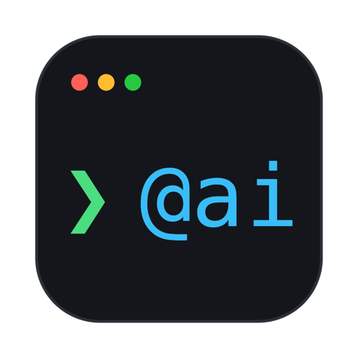

<div align="center">



# aiTerminal

### ⚡ Fast. 🪶 Light. ✨ AI-first.

A terminal written **from scratch in Rust** — **zero external crates**, no Electron, no web view.

[](LICENSE)
[](https://www.rust-lang.org/)
[](Cargo.toml)
[](https://github.com/mourad-ghafiri/aiTerminal/releases)

**[🌐 Website](https://mourad-ghafiri.github.io/aiTerminal/)** ·
**[📖 Docs](docs/README.md)** ·
**[⬇️ Download](https://github.com/mourad-ghafiri/aiTerminal/releases)**

</div>

---

It is a *terminal*, full stop: PTY panes, tabs and splits, themes, keymaps, plugins,
profiles. The AI is woven into the shell itself through one idea:

> 💡 **Everything is a terminal command.** No settings UI, no side apps — you type
> `@`-commands at your normal prompt and edit TOML files.

```text
❯ @ai find the 5 biggest files under src and sort them
❯ press Enter to run (or edit)
❯ du -a src | sort -rn | head -5

❯ @coder "add a --json flag to the export command"        # a full agentic run
❯ @flow review "the auth module"                          # 3 reviewers, in parallel
❯ @loop "make the tests pass"                             # iterate until verified
❯ @flow build --bg "migrate configs to TOML"              # …in the background
❯ @job "check the logs at midnight"                       # the AI reads the schedule
❯ @gate telegram start                                    # drive this pane from your phone
❯ @profile switch work                                    # live profile switch
```

## 🌟 Highlights

- 🦀 **A real terminal, built from nothing** — a from-scratch VT engine, PTY, GPU
  renderer, TOML/JSON parsers, regex engine, BM25 ranker, HTTP transport. The
  dependency list is empty, and CI keeps it that way.
- ✂️ **Native-feel editing** — `⌥/⌘ arrows` jump by word / to the line ends,
  `⇧`+arrows **select on the command line** (a light band, your syntax colors
  stay on top), typing replaces the selection, `Esc` cancels, `⌘C` copies.
  All of it is a zsh plugin (`lineedit`), not hardcoded terminal magic.
- 🧘 **Calm, stable rendering** — steady block cursor (`bar`/`underline` one config
  line away), ghost-free damage-tracked frames, burst-settled presents, an idle
  event loop that uses near-zero CPU.
- 🔋 **31 builtin plugins, all data** — prompt, autosuggest, syntax highlighting,
  completion, history, git (100+ aliases), docker, kubernetes, extract, jump,
  sudo, clipboard (OSC 52), … Each is a `plugin.toml` + optional shell snippet;
  disable any with `@plugin disable <name>`.
- 🎨 **19 live themes** — `@theme <name>` restyles the window, the prompt, syntax
  colors and `ls` colors from any shell, instantly.
- 👤 **Profiles that mean it** — per-profile config overlay + saved workspace
  (tabs, splits, per-pane cwd/zoom, styled scrollback). `@profile switch work`
  from any shell; the window follows live.
- 🛡️ **AI with guardrails** — provider-agnostic streaming engine, weighted
  multi-model pools, agents/skills/prompts as Markdown, flow graphs as TOML, BM25
  memory, MCP, sub-agents — behind a command guard (allow/deny/confirm) and
  secret redaction on every egress path. AI is **off** until you declare a model.

## ✨ The command family

| Command | What it does |
| --- | --- |
| 🪄 `@ai <request>` | Natural language → one shell command, checked by the command guard, preloaded for review (or auto-run per `[ai] mode`). |
| 🤖 `@<agent> <task>` | Run a named agent's full tool loop (read/search/edit/run, memory, MCP) and print its report. Ships with `coder`, `explorer`, `reviewer`, `tester`. |
| 🔀 `@flow <name> "<input>"` | Run a workflow **graph**: independent nodes run at the same time, `when` routes on the edge, a `run` node costs no tokens, and `goto` retries a bounded number of times. Five ship — `build`, `fix`, `review`, `research`, `document` — and a bare `@flow "<goal>"` is routed to one by the model, which prints its choice before spending anything. `@flow check` proves a graph before it runs; `@flow graph` draws it as a real diagram with a table of what each node reaches; you watch it **as a graph** — a rank is a column, so depth is something you see and work that runs together stacks together, with a pane under the cards following whichever node is working; and `@flow nodes` / `node` / `watch` / `retry` / `resume` give you the run a node at a time. |
| 🧾 **Not just for code** | `@ai summarise @lease.pdf` · `@flow research "which e-bike for a hilly commute"` · `@writer "turn @notes.md into a brief"` · `@job "every Monday at 9, summarise ~/Documents/inbox"` · `@md edit letter.md`. The docs' [Without writing code](docs/ai.md#without-writing-code) table says what each one needs — and `@md`, `@theme`, `@agent`, `@flow check` and `@job -- <command>` need no model at all. |
| 🧑‍🔬 `@agent [<name>]` | The eight agents you have — planner, explorer, researcher, coder, tester, reviewer, writer and the assistant — with their tools, step caps and what each returns. Every one is an editable Markdown file. |
| 🔁 `@loop "<goal>"` | Iterate an agent until the goal **verifies**. `--check "<cmd>"` is a binary stop condition; with none, the AI proposes a real one from the goal (guard-adjudicated — a "verifier" that deploys is refused) and it is **proven before the first token is spent**: already green costs nothing, unrunnable is caught up front, and a failure seeds iteration 1. Bounded on iterations, tokens *and* wall clock; repeats and oscillations both count as no progress and buy exactly one materially-different retry. Every iteration is recorded, so `@loop show/log/resume` pick it back up. |
| 📊 `@job "<request>"` | Say what to do **and when** — `@job "check the logs at midnight"`, `@job "summarize the kafka logs into ~/reports every hour"`. The AI reads the schedule out of the sentence *once*, at creation, and writes it into the record as cron; every run after that is plain arithmetic. `--` makes it a **command** job (`@job --every 15m -- ./sync.sh`) that needs no model at all, guard-checked like everything else. Recurring jobs survive a reboot — the supervisor re-arms them and catches a missed one up **once**. `@job` lists next fire · last outcome · runs; `show`/`log -f`/`cancel`/`clear` do the rest. |
| 📄 `@md <file>` | `@md render` pretty-prints a Markdown file the way GitHub would — **all of GFM plus the HTML subset** (alerts, footnotes, `<details>`, centered blocks, HTML tables, `<kbd>`), **syntax-highlighted code**, **images drawn as pixels**, and **every mermaid diagram type** drawn natively (box art in other terminals); `@md edit` is a live split editor — Markdown left, rendered preview right, scroll by keyboard + mouse. |
| 📱 `@gate telegram start` | Hand a tab or split to a chat app and drive your terminal from your phone. The pane becomes a shell you **share** — you keep typing while a paired chat runs commands in the same session — plus `/shot` for a screenshot of the live terminal. **Start Claude Code, Codex, `vim` or a REPL and the gate attaches**: the chat becomes that program's live screen, with buttons for whatever it is asking — detected from the terminal protocol itself, so it works for any program with no per-app code. Off by default; nothing is accepted until a chat sends the pairing code printed in your pane. |
| 👤 `@profile [<id>]` | List profiles, switch directly (`@profile work`), `create`/`rename`/`delete`, and `edit` (opens the overlay in `$EDITOR`). A running window follows switches and edits live. |
| 🔒 The redactor | Secrets are rewritten on their way **out**: AWS/OpenAI/Anthropic/GitHub/Slack/Google keys, bearer tokens, JWTs, PEM blocks and any sensitive `KEY=value` become `«redacted»` before a model, a chat app or the session file sees them. Targeted, not blanket — your connection strings still get through, so the AI stays useful. Scoped `ai` by default, so your own screen keeps showing your own values. |
| ⚙️ `@config` / `@theme` / `@plugin` | Inspect config, list/**switch** themes live (`@theme nord`), manage plugins. |

`@`-commands ride the shell's `command_not_found` hook, so they can never shadow a
real command, and everything streams straight into your terminal scrollback.

## 🔋 Batteries included — 31 plugins, pure data

A plugin is a `plugin.toml` — nothing compiles, nothing slows your prompt.

| | Category | Plugins |
| --- | --- | --- |
| 💻 | **Shell UX** | 🎨 syntax-highlight · 👻 autosuggest · 🧠 history · ⌨️ completion · ✂️ lineedit · 💡 alias-hints · 🚀 prompt · 🔼 sudo · 📁 dir · 🧭 jump · 🌍 term-cwd |
| 🛠️ | **Git & dev** | ⎇ git · 🐙 github · 🐳 docker · ☸️ kubernetes · 🦀 rust · 🐍 python · 📦 node |
| 🧰 | **Utilities** | 🗜 extract · 📋 clipboard · 🔐 encode · 🔎 web-search · 🌦 weather · 🕰 world-clock · 📝 notes · 📟 sysinfo · 📖 colored-man · 🧰 common |
| ✦ | **AI & safety** | ✦ ai-terminal · 🛡 command-guard · 🕶 redactor |

## ⌨️ Your muscle memory, respected

iTerm-style defaults; rebind anything with a `[[keybinding]]` — layout-correct on
AZERTY and friends.

| Action | Keys |
| --- | --- |
| New tab / close tab | `⌘T` `⌘W` |
| Split right / down | `⌘D` `⌘⇧D` |
| Quick switcher | `⌘P` / `⌘K` |
| Jump to tab | `⌘1`…`⌘9` |
| Focus pane | `⌘⌥←↑↓→` |
| Zoom pane | `⌘↩` |
| Per-pane font zoom | `⌘=` `⌘−` `⌘0` |
| Scroll history | `⇧PgUp` `⇧PgDn` |
| Reload config live | `⌘,` |

## ⬇️ Install (macOS)

One command — it clones the source at the **newest release tag**, installs Rust if you
don't have it, builds the app, and puts `aiTerminal.app` in `/Applications`:

```sh
curl -fsSL https://mourad-ghafiri.github.io/aiTerminal/install.sh | sh
```

The **same command updates** it later, to whatever the newest release is by then. Set
`AITERMINAL_REF` to build something else — `AITERMINAL_REF=v0.4.0` for an older release,
`AITERMINAL_REF=main` for the tip.

To uninstall — your settings in `~/.aiTerminal` are kept unless you add `--purge`:

```sh
curl -fsSL https://mourad-ghafiri.github.io/aiTerminal/install.sh | sh -s -- remove
```

## 🚀 Build & run

```sh
cargo build --release          # zero third-party crates — this is fast
./target/release/aiTerminal    # the window
aiTerminal ai "hello"          # the CLI (what @ai calls)
```

### 🍎 Or build the macOS app

```sh
./tools/bundle-macos.sh                  # this Mac's CPU → dist/aiTerminal.app
open dist/aiTerminal.app                 # run it — or install it:
cp -R dist/aiTerminal.app /Applications/ # then launch from Spotlight / the Dock

./tools/bundle-macos.sh all              # arm64 + x86_64 + universal, ready to ship
```

The script produces a self-contained bundle (release binary + the `builtin/`
data + icon) for **Apple Silicon, Intel, or a universal binary** —
`dist/aiTerminal-macos-{arm64,x86_64,universal}.zip`. Cross-building needs the
other standard library once: `rustup target add x86_64-apple-darwin` (or
`aarch64-apple-darwin`). See [docs/packaging.md](docs/packaging.md).

Configuration lives in `~/.aiTerminal/config.toml` (seeded, documented). AI is off
until you declare a model — see the `[ai]` section in the config, or
[docs/ai.md](docs/ai.md).

## 🔍 What's inside

- 🖥️ **Terminal**: a from-scratch VT engine + PTY, tabs, splits, per-pane zoom,
  scrollback, mouse *and keyboard* selection (`⇧`/`⇧⌥`/`⇧⌘` + arrows), Enter on a
  mouse selection copies instead of executing, block/bar/underline cursor,
  OSC 52 clipboard (write-only — reads are refused), a tab quick-switcher
  (`Cmd+P`), ⌘-click to open URLs/paths, and a plugin-driven status bar.
- 🧠 **AI engine**: streaming, provider-agnostic (Anthropic, OpenAI, OpenRouter,
  DeepSeek, Ollama, … — models are data files), weighted multi-model pools, a
  live harness experience (spinner, streamed thinking, timed tool trace,
  token/elapsed footers), vision/PDF/text attachments (`@path` in any prompt),
  agents/skills/prompts as Markdown files, flow graphs as TOML, BM25 memory, MCP
  servers, sub-agent delegation (`task.run`), and a command guard + secret
  redaction on every egress path.
- 👤 **Profiles**: each profile owns a `config.toml` overlay + its saved tabs/splits.
  Switch from any shell with `@profile switch <id>` — the window applies it live.
- 🧩 **Plugins**: declarative TOML + shell snippets (prompt, completion, autosuggest,
  history, lineedit, git aliases, guard rules, redaction rules, …). The engine is
  generic; features are data.
- 🎨 **Themes / keymaps / i18n**: all TOML files, composable, reloadable live
  (`Cmd+,`); every user-facing string localizes via `i18n/<locale>.toml`
  (`[appearance] locale`, per-profile overridable).

## 🗺️ Layout

```text
crates/corelib     pure foundations: wire (TOML/JSON), gfx, types, theme, unicode
crates/platform    the OS seam (macOS FFI, PTY, CoreText, Metal) + VT engine + transport
crates/framework   the terminal window, plugins, security, config, profiles, i18n, the AI runtime, the CLI
crates/app         the thin `aiTerminal` binary
builtin/           data: plugins, themes, keymaps, agents/skills/prompts/flows/models, config
docs/              the manual
```

Four CI gates keep it honest: 🚫 **zero external crates**, 🧱 **strict layer edges**,
🔒 **`unsafe` confined to `platform/src/os/`**, and 📏 **no source file over 1000 lines** —
the last one so the code stays contributable, not just correct.

## 🧪 Tested

**1327 unit tests** and **273 scenarios**, in a few seconds, with no network and no API key.

A unit test proves a function; a **scenario** proves a *product*. Scenarios are real user
journeys written as TOML and played against the real code — *a destructive suggestion is
blocked before it can reach the shell*, *a chatty model cannot smuggle a second command
into your shell*. When `@gate` shipped with a full unit suite and users still hit bugs,
35 scenarios against that same code found **22 defects** that no unit test could see.

The suite is hermetic and harmless by design: all AI is mocked (scripted transports
replaying real provider SSE, dummy keys), no network, no user state (temp `$HOME`s), and
no dangerous commands — which is what makes it safe to write a test *about* `rm -rf /`:
the string exists only as text asserted to go nowhere.

📖 [docs/testing.md](docs/testing.md) — every kind of test, and what isn't covered.

## 📚 Docs

Start at [docs/README.md](docs/README.md) — getting started, architecture, the AI
guide, configuration, keybindings, plugins, security, themes, packaging.

## 📄 License

This project is licensed under the [MIT License](LICENSE).

---

<div align="center">

**Your prompt is about to get *superpowers*.** ✨

Free and open source. Bring any AI provider — or none. Your keys stay in your
config, your secrets get redacted, and the guard has the last word. 🛡️

⭐ **[Star on GitHub](https://github.com/mourad-ghafiri/aiTerminal)** ·
⬇️ **[Download](https://github.com/mourad-ghafiri/aiTerminal/releases)** ·
🌐 **[Website](https://mourad-ghafiri.github.io/aiTerminal/)**

</div>
