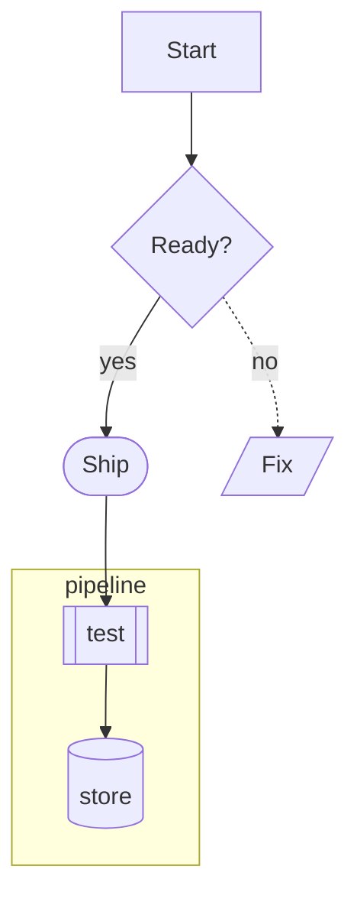
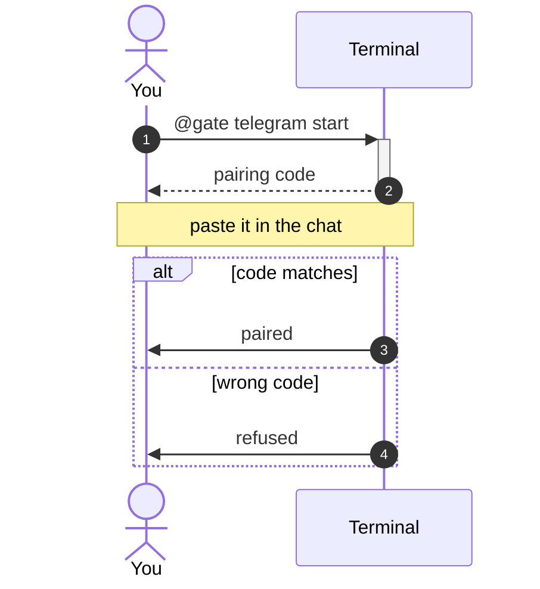
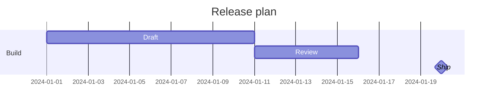

# Diagrams

Every diagram in a Markdown file — or in an AI answer — is **drawn**, never shown as source.
Inside aiTerminal it is rasterized as real pixels over reserved grid rows; in a pipe, tmux, CI
or any other emulator the same layout is drawn in Unicode box art. Only a diagram that cannot
be read at all falls back to a boxed source.

```sh
@md render notes.md         # drawn inline
@ai explain the auth flow   # the model draws when a picture helps
```

## What is supported

All of mermaid's diagram types:

| Family | Types |
| --- | --- |
| Flow | `flowchart` / `graph` (every shape, every link kind, `subgraph`, `&` fan-out, `direction`) |
| Interaction | `sequenceDiagram` (activations, notes, `loop`/`alt`/`opt`/`par`/`critical`/`break`, `box`, `autonumber`, `create`/`destroy`) |
| Structure | `classDiagram`, `stateDiagram[-v2]`, `erDiagram`, `requirementDiagram`, `C4Context`/`C4Container`/`C4Component`/`C4Dynamic`/`C4Deployment`, `architecture-beta`, `block-beta` |
| Story | `mindmap`, `timeline`, `journey`, `kanban`, `gitGraph` |
| Data | `pie`, `xychart-beta`, `quadrantChart`, `gantt`, `sankey-beta`, `radar-beta`, `treemap-beta`, `packet-beta`, `info` |

Frontmatter (`---`), `%%{init}%%` config and `%%` comments are understood and skipped, as are
the styling directives (`classDef`, `class`, `style`, `linkStyle`, `click`, `cssClass`): a
diagram always wears the **active terminal theme**, so it restyles with `@theme` and stays
readable in light and dark.

## A few examples

A flowchart, with shapes and a subgraph:

````markdown

````

A sequence, with an activation, a note and an either/or:

````markdown

````

A chart:

````markdown

````

## How it works

Three pure stages in `corelib::mermaid`, each testable on its own:

1. **Parse** — source → a `Diagram`. One module per language, all tolerant: an unreadable
   statement is skipped rather than failing the diagram, and every list is bounded.
2. **Layout** — `Diagram` → a `Scene`: a display list of shapes, paths, wedges and labels
   carrying *roles* rather than colors. Text sizing is injected by the host, and every spacing
   constant is expressed in em units — which is what lets one layout serve both renderers.
3. **Render** — the app's GPU renderer maps roles onto the theme and draws pixels; the text
   renderer rasterizes the same scene into character cells.

Box-and-arrow types share one layered engine (`layout/layered.rs`): longest-path ranks over
the acyclic part of the graph, a median heuristic to cut crossings, and orthogonal routing
that leaves and enters boxes at their facing edges.

Two shapes have no honest form in character cells — a pie's wedges and a radar's polygon — so
in text mode those lay out as labelled bars instead. Same numbers, ink that actually exists.

## Limits

- A diagram wider than the pane is drawn top-to-bottom instead when it is a side-to-side
  flowchart; if it still does not fit, the source is shown in a box rather than a mangled
  picture.
- Colors from the diagram's own styling directives are deliberately ignored (see above).
- `zenuml` is a separate upstream DSL and is not read; its diagrams fall back to the box.
